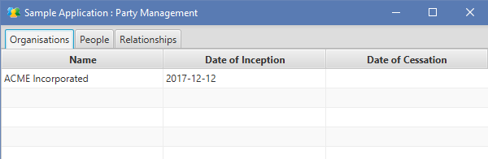
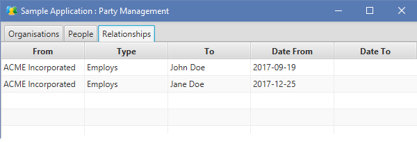

# Party
This is an implementation of the first agile architect's pattern, addressing the universal theme of relationships between people and organisations.

This model allows organisations to be defined:

People can be defined:

And finally, relationships can be drawn between these:

The model itself forms a flexible framework allowing different types of relationship to be modelled. Some examples of these include:
 - Employment (between an Employer and Employee)
 - Learning (between a Teacher and a Learner or Student)
 - Social (between Parent and Child, or Sibling to Sibling)

# Class Diagram

This model allows for a flexible set of relationships that are controlled by creating instances of PartyType, RoleType and RoleTypeRelationship as follows:

1. Identifiable Object

   This abstract class provides a mechanism for allocating unique ids to instances that require them. This removes the dependency on an external system (such as a database) to generate unique ids and allows the object model to be marshalled to XML with valid references.

2. Party

   This is an abstract class used to represent either a Person or an Organisation. A Party can have relationships with other Partys and this is managed through the PartyRelationship class.

3. Organisation

   Pretty self-explanatory, a placeholder for information held about an organisation.

4. Person

   Also self-explantatory, this is a placeholder for information held about a person.

5. PartyKind

   This is the first of the "configuration" type enumerations and holds the valid types of party - in this example, these are "Organisation" and "Person".

6. RoleKind

   This enumeration defines which roles are valid for Parties to assume as part of a relationship to another Party. Some examples of possible roles include:
   - Customer
   - Supplier
   - Teacher
   - Learner
   - Employer
   - Employee

   The roles could be expressed as generic or as specific as a particular problem domain dictates. More specific roles may be:
   - Public Limited Company
   - Limited Company
   - HM Revenue and Customs (HMRC)
   - Chief Executive Officer (CEO)
   - Software Engineer

   Note also that the RoleType is specific to a PartyType, e.g. "Employer" may be specific to "Organisation".

7. RoleRelationshipKind

   This enumeration defines what relationships are valid between roles and hence available as PartyRelationships.

8. PartyRelationship
   
   This is the core class for this model, and effectively becomes an "instance" of a RoleTypeRelationship. 

# Sample JSON
    {
      "people" : [ {
        "id" : "97a6690d-ae73-4583-ad13-02698f964e13",
        "givenName" : "John",
        "familyName" : "Doe",
        "dateOfDeath" : "",
        "dateOfBirth" : "1970-03-01"
      } ],
      "organisations" : [ {
        "id" : "57527121-0511-4ac4-8701-4af0694a0830",
        "organisationName" : "ACME Incorporated",
        "dateOfInception" : "2017-12-13",
        "dateOfCessation" : ""
      } ],
      "relationships" : [ {
        "id" : "8b637c4e-dea6-4f88-aaa8-34f8b831eaa2",
        "from" : "57527121-0511-4ac4-8701-4af0694a0830",
        "to" : "97a6690d-ae73-4583-ad13-02698f964e13",
        "relationshipType" : "EMPLOYS",
        "effectiveFrom" : "2017-12-28",
        "effectiveTo" : ""
      } ]
    }