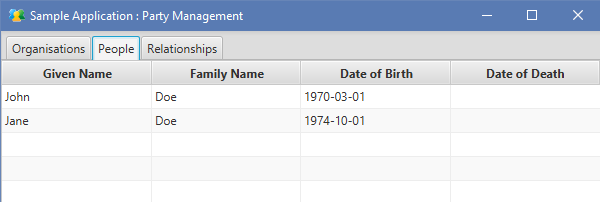
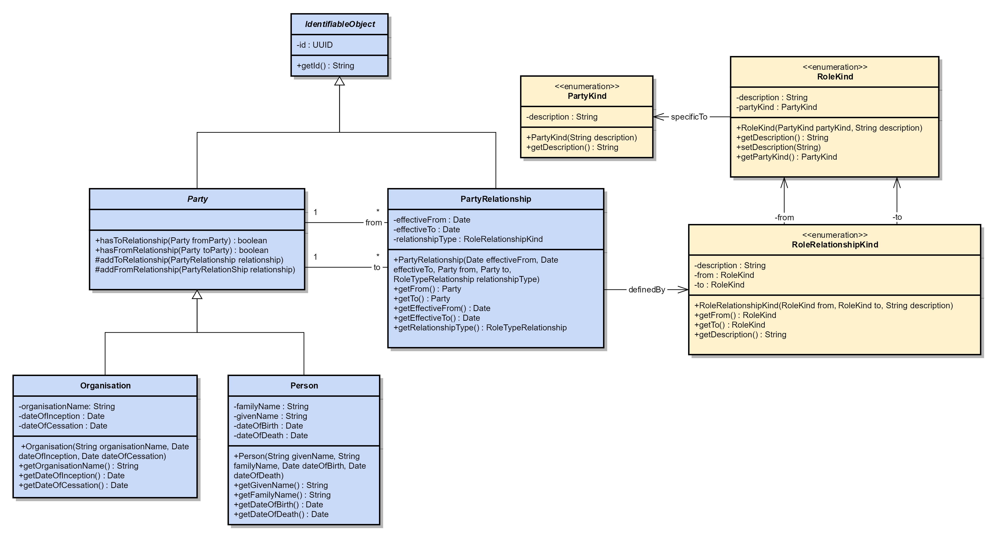

# Party
This is an implementation of the first agile architect's pattern, addressing the universal theme of relationships between people and organisations.

This model allows organisations to be defined:

People can be defined:

And finally, relationships can be drawn between these:

The model itself forms a flexible framework allowing different types of relationship to be modelled. Some examples of these include:
 - Employment (between an Employer and Employee)
 - Learning (between a Teacher and a Learner or Student)
 - Social (between Parent and Child, or Sibling to Sibling)

# Class Diagram

This model allows for a flexible set of relationships that are controlled by creating instances of PartyType, RoleType and RoleTypeRelationship as follows:

1. Identifiable Object

   This abstract class provides a mechanism for allocating unique ids to instances that require them. This removes the dependency on an external system (such as a database) to generate unique ids and allows the object model to be marshalled to XML with valid references.

2. Party

   This is an abstract class used to represent either a Person or an Organisation. A Party can have relationships with other Partys and this is managed through the PartyRelationship class.

3. Organisation

   Pretty self-explanatory, a placeholder for information held about an organisation.

4. Person

   Also self-explantatory, this is a placeholder for information held about a person.

5. PartyType

   This is the first of the "configuration" type classes and holds the valid types of party - in this example, these are "Organisation" and "Person".

6. RoleType

   This class defines which roles are valid for Parties to assume as part of a relationship to another Party. Some examples of possible roles include:
   - Customer
   - Supplier
   - Teacher
   - Learner
   - Employer
   - Employee

   The roles could be expressed as generic or as specific as a particular problem domain dictates. More specific roles may be:
   - Public Limited Company
   - Limited Company
   - HM Revenue and Customs (HMRC)
   - Chief Executive Officer (CEO)
   - Software Engineer

   Note also that the RoleType is specific to a PartyType, e.g. "Employer" may be specific to "Organisation".

7. RoleTypeRelationship

   This class defines what relationships are valid between roles and hence available as PartyRelationships.

8. PartyConfig

   This class acts as a wrapper for the configuration classes, providing a simple means to serialize or marshal the data.

9. PartyRelationship
   
   This is the core class for this model, and effectively becomes an "instance" of a RoleTypeRelationship. 

# Sample JSON
      {
        "config" : {
          "partyTypes" : [ {
            "id" : "0ee898a9-50f7-4871-952e-2de127f5fe72",
            "description" : "Organisation"
          }, {
            "id" : "27e15c95-8345-4fb1-bbe9-efcdc1564148",
            "description" : "Person"
          } ],
          "roleTypes" : [ {
            "id" : "d3e6fa80-681d-42a1-9daa-542ac0059334",
            "description" : "Employer",
            "partyType" : "0ee898a9-50f7-4871-952e-2de127f5fe72"
          }, {
            "id" : "8fb0ec64-91cd-443c-a1cf-b794a5ad52fd",
            "description" : "Employee",
            "partyType" : "27e15c95-8345-4fb1-bbe9-efcdc1564148"
          }, {
            "id" : "4223bb4a-2a8f-4c53-9905-45354dab7652",
            "description" : "Teacher",
            "partyType" : "27e15c95-8345-4fb1-bbe9-efcdc1564148"
          }, {
            "id" : "8271c319-d6e7-454b-9e07-879ed67e9688",
            "description" : "Student",
            "partyType" : "27e15c95-8345-4fb1-bbe9-efcdc1564148"
          } ],
          "roleTypeRelationships" : [ {
            "id" : "0644c905-31b5-446a-9f20-f5ddd0fd2380",
            "from" : "d3e6fa80-681d-42a1-9daa-542ac0059334",
            "to" : "8fb0ec64-91cd-443c-a1cf-b794a5ad52fd",
            "description" : "Employs"
          }, {
            "id" : "fafc0889-c5b9-467d-98ee-594b622c9b01",
            "from" : "4223bb4a-2a8f-4c53-9905-45354dab7652",
            "to" : "8271c319-d6e7-454b-9e07-879ed67e9688",
            "description" : "Teaches"
          } ]
        },
        "people" : [ {
          "id" : "d5cc1cc4-b25f-477f-870a-87dd68324858",
          "givenName" : "John",
          "familyName" : "Doe",
          "dateOfBirth" : "1970-03-01",
          "dateOfDeath" : ""
        }, {
          "id" : "63ba92ab-e1f1-4fe6-9e2f-fd1740270c4d",
          "givenName" : "Jane",
          "familyName" : "Doe",
          "dateOfBirth" : "1974-10-01",
          "dateOfDeath" : ""
        } ],
        "organisations" : [ {
          "id" : "198532c7-9f4c-4e8b-8e60-70cffcee397a",
          "organisationName" : "ACME Incorporated",
          "dateOfInception" : "2017-12-12",
          "dateOfCessation" : ""
        } ],
        "relationships" : [ {
          "id" : "ae3485d9-1037-46a7-b1ac-82424918081b",
          "from" : "198532c7-9f4c-4e8b-8e60-70cffcee397a",
          "to" : "d5cc1cc4-b25f-477f-870a-87dd68324858",
          "relationshipType" : "0644c905-31b5-446a-9f20-f5ddd0fd2380",
          "effectiveFrom" : "2017-09-19",
          "effectiveTo" : ""
        }, {
          "id" : "ea284cfc-0b46-4ad4-91dc-a3cd4f638ab8",
          "from" : "198532c7-9f4c-4e8b-8e60-70cffcee397a",
          "to" : "63ba92ab-e1f1-4fe6-9e2f-fd1740270c4d",
          "relationshipType" : "0644c905-31b5-446a-9f20-f5ddd0fd2380",
          "effectiveFrom" : "2017-12-25",
          "effectiveTo" : ""
        } ]
      }
